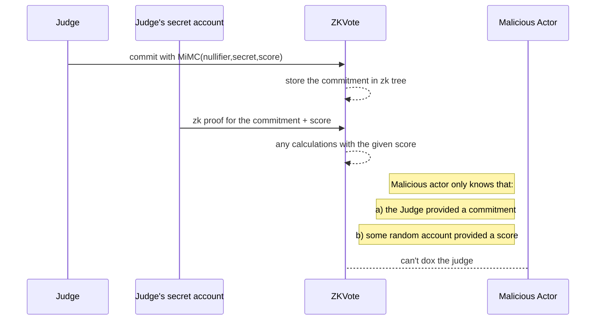

# 📈 ZKVote

Anonymous voting in Solidity.
This is based on [zk-merkle-tree](https://github.com/TheBojda/zk-merkle-tree) library by TheBodja.

Here the circuits are modified with a value called `score` which allows to store additional data in the commitment.

Also a PoC voting app is provided (`ZKVote.sol`), here is a simplififed diagram for the core privacy layer:



## 🔧 Setting up Local Development

```bash
$ git clone https://github.com/vasemkin/zk-vote.git
$ cd zk-vote
$ nvm install
$ nvm use
$ npm i -g pnpm
$ pnpm install
$ pnpm prepare
```

## Testing

```bash
$ pnpm test
```
